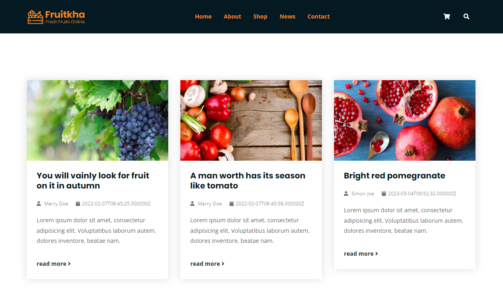

# [PHP, JAVASCRIPT] 4SFRUITS WEBSITE

## Introduction

Here is my php source code for NEWS BLOG. With my code: 
* **Create products & articles on fruits topics or different topics with the CRUD function**
* **The backend and front-end are separated. They are connected through APIs.**

## Detail
* **Product**

 

* **Articles**

 
 

* **Cart**
 

## Technologies:
* **PHP, Laravel, Javascript, Nuxtjs, Vuex, HTML, CSS, SCSS**

## How to run my code:
* **Step 1: Clone project**
* **Step 2: Go to the project folder**
* **Step 3: Import database 4sfruits.sql in root folder**
* **Step 4: In 4sfruits-be folder: copy the .env.example file to .env on the root folder**
* **Step 5: Cd 4sfruits-be folder and run "composer install" on your cmd or terminal**
* **Step 6: Run "php artisan key:generate"**
* **Step 7: Run "php artisan serve"**
* **Step 8: Go to the admin page with username: admin and password: phuongnam123**
* **Step 9: Cd 4sfruits-fe folder: run "yarn install"**
* **Step 10: Run "yarn dev"**

## Requirements
* **PHP version >= 7.3**
* **Node version > 14**
* **Composer**
* **Yarn**